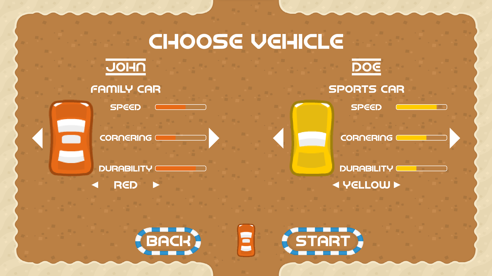
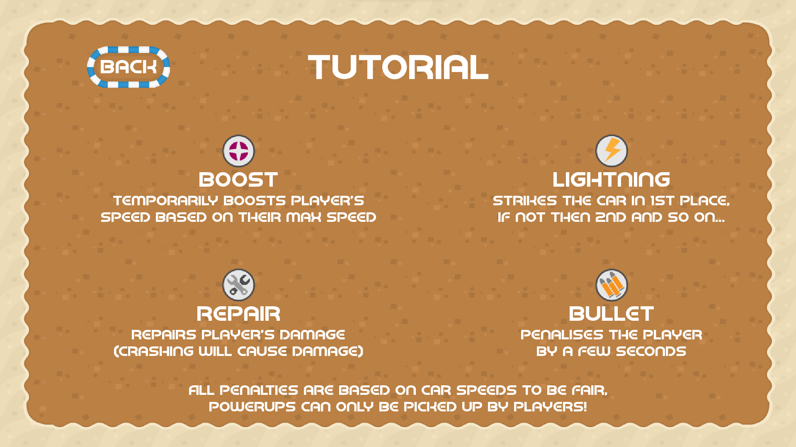
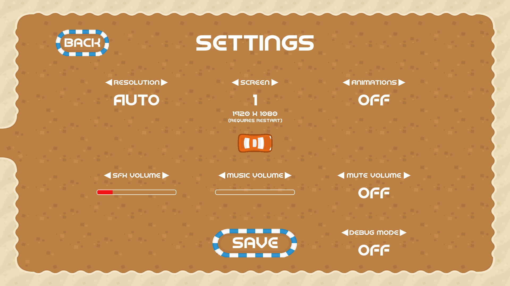

Retro Rampage is a 2D multiplayer racing game developed using [pygame](https://www.pygame.org/news) featuring a retro theme  
and intense gameplay featuring powerups with several animations, multiple maps and multiple vehicles  
that support up to 6 players as well as up to 5 NPC vehicles in a race!

## Index

- [Installation](#installation)
- [Game details](#game-details)
- [Settings](#settings)
- [Technical info](#technical-info)
- [Credits](#credits)

<h1 id="installation">Installation</h1>

> Installing Retro Rampage takes 4 easy steps: **(You will need git installed to do this!)**
> 1. Create a new folder
> 2. Open a command line and use `cd` to move to the created folder
> 3. Type `git init` and hit enter
> 4. Type `git clone https://github.com/bungee-boy/Retro-Rampage.git` and hit enter

As python is commonly already installed on most systems by default, it should run without manual installation of  
python. Furthermore, if the game is launched and fails to `import pygame` then a prompt will show and ask the  
user to try and automatically install it for them to minimise hassle. If all else fails, the user will have to manually  
install `pygame` to be able to play the game.

<h1 id="game-details">Game details</h1>

Retro Rampage is a 2D racing game that can be played with friends or race against the built-in NPCs.  
The game was created as a Computer Science A-level project,  
but was always intended to be supported long after the course had finished.

It can handle a maximum of 6 players simultaneously and offers a mix of controllers and/or keyboard for controls  
(eg, One person could use WASD/Arrow controls while 3 others use controllers).  
If there are less than 6 players then the rest of the spaces can also be filled in with an optional amount of NPCs.

The game features a simplistic design with forwards, backwards left and right controls being the only input,  
however players have the option to enable powerups which can give them an advantage or disadvantage,  
depending on the type they pick up. (NPCs never pick up powerups)

As this game is only 2D and runs purely in Python 3, it is very performant and has several features to try and improve  
on the amount of processing power this game needs to run such as slowing down screen updates if the user tabs out  
which dramatically decreases the amount of processing the game uses when it is running.

## Vehicles

There are 5 types of cars:
- Family car
- Sports car
- Luxury car
- Truck
- Race car

All cars have different attributes related to them that affect how they behave:  
Speed determines how fast the car goes with no damage  
Cornering determines how fast the car turns for corners  
Durability is the amount of hits or 'damage' the vehicle can take before it is at the slowest speed.
Damage can be obtained by making contact with an object such as the track barrier or another vehicle,  
and is also used by powerups.

Each car also has a choice of 5 colours:
- Red
- Green
- Yellow
- Blue
- Black

NPCs can also be forced to pick a car and colour if the player wants a better contrast between players and non-players.

## Powerups

As mentioned above, powerups can only be used by the player(s) and spawn randomly on the track during a race (if enabled).
There are 4 types of powerups, and not all provide an advantage:
- Repair (Repairs and removes a player's damage)
- Boost (Gives the player a temporary speed boost)
- Lightning (Randomly causes an NPC to crash)
- Bullet (Penalises the player, as if they had been hit by a lightning by not allowing them to move for a time)

The spawn rates of powerups is determined by the amount of players and NPCs on the track (fewer vehicles = less powerups).  
All time related powerups such as the Boost and Bullet are determined by the player's current speed so that  
if a player was in a Race car (speed 5) with no damage then they will have a short Boost, however if the same car is damaged  
and therefore has a speed of 1 they will have a much longer Boost time and will always return to the same speed after a boost.  

<h1 id="settings">Settings</h1>

Currently, the game includes several settings related to video, audio and optional features.  
The settings that are implemented so far are:
- Resolution option including presets and 'auto' option
- Screen option for multiple monitor setups
- Menu animations can be toggled on or off
- Music volume
- Sound effects volume
- Mute all sound toggle
- Debug mode toggle

All settings are self-explanatory except for 'Debug mode', which is used during development and changes the following features:
- Error handling is turned off (requires restart to work)
- Outlines of almost all assets and drawings are shown (where applicable)
- The mouse is always shown and doesn't get hidden during races
- The game will always update the entire screen rather than adaptively changing only the parts that have changed
> As there are a lot more things to draw on the screen (all the outlines), turning on Debug mode   
> will result in a performance drop on low-end machines!

<h1 id="technical-info">Technical info</h1>

## File structure

This game is built purely in python and only has one dependency that doesn't come with python and that is  
`import pygame`. There are also 5 custom libraries that I have used to simplify the structure of the game  
by having 5 separate files that handle the directory paths and return them to `main.py`.  
These are:
- `audio_loader.py`
- `font_loader.py`
- `image_loader.py`
- `map_loader.py`
- `path_loader.py`

All of these files are located within */assets* as they handle all the paths from there.  
`__init__.py` is just so that python knows that it can import those files from */assets*.  
I would have done the image and sound processing in these files as well as the path handling,  
however the variables would be local and couldn't be accessed from `main.py`  
so the processing has to be done there.

## Display & resolution management

To allow the game to support multiple resolutions with the least amount of code, I have designed my own system where the game  
never directly draws to the screen with assets or text, the user is always looking at the `Window` which is different from the `Display`,  
as `Window` is a `pygame.surface.Surface` that all the game is drawn to, then when the screen needs updating the `Window` is scaled  
to the `Display` and updates either the entire screen or specific parts that have changed for performance.

## Menu implementation

For the menu screens, there is a standard format that all windows generally follow which is that the window will have its own  
function such as `main_window()` or `credits_window()` that draws all the default assets for that window and can be moved as one,  
with the background being passed through as a variable. This allows for different backgrounds and a more versatile implementation  
that is proven through the pause settings being the same code as the menu settings making screen management easy.  
Having all the assets move at once is also useful for animations such as the menu animations,  
however have been optimised to take a screenshot and move it rather than all the assets every frame as it was too demanding  
on some hardware. All the logic for each window is also separated from the graphics so all the logic can be grouped together  
in the main loop, allowing every button to have their own commands and functions.

## Player management

Players are built upon each other until they become a functional car using classes. In the menus, when a player is choosing their  
player specific settings such as their car and colour, the options are saved in a `Player` class that is organised in a list of  
current players. When the game starts, the `Player` class is taken and given to the `Car` class that implements things like  
movement controls and collisions etc. NPCs also have their own class that is similar to the `Car` class for players however  
instead of the controls they have predefined paths to follow, and other small changes like no powerup collisions.

## Game and menu music

Initially, the game would check every loop if the music had ended and then play the next one,  
however if the loop wasn't running fast enough then it resulted in gaps between the music.  
Therefore the game and menu music now have their own personal threads that constantly poll the music to see if the track  
has finished and allows the game to instantly play the next track regardless of what the main thread is doing for the game  
such as loading a race or checking collisions, the music will still instantly carry on to the next track!

<h1 id="credits">Credits</h1>

- Development and testing -> Anthony Guy
- Game art -> Kenney Vleugels
- Menu music -> Trevor Lentz
- Gameplay music & Sound effects -> Juhani Junkala
- Guidance & Support -> Jonny Farmer & Keith Brown
